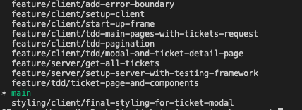
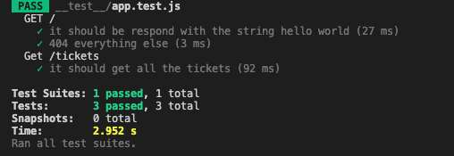
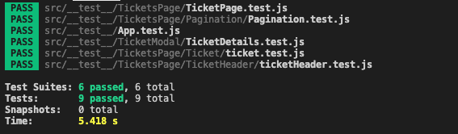
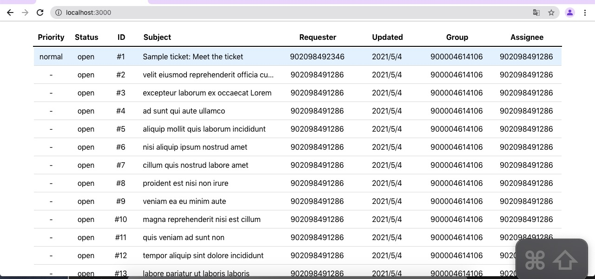
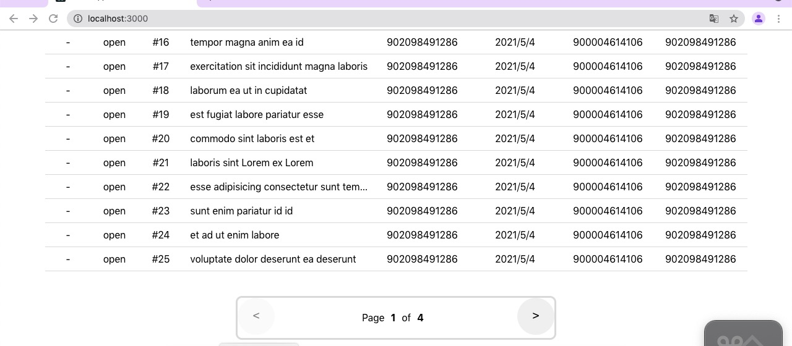
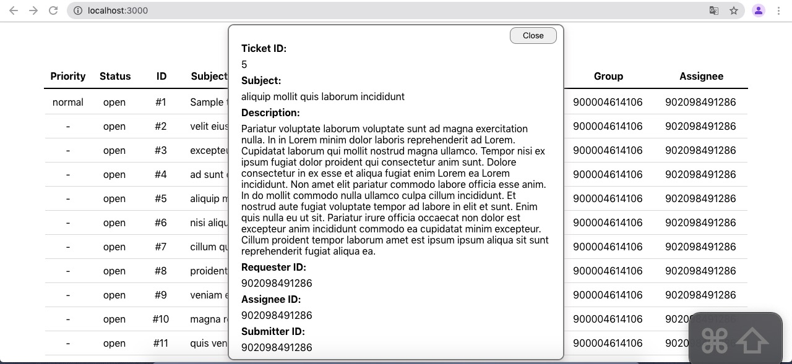

## Table of contents

- [Table of contents](#table-of-contents)
- [General info](#general-info)
- [Technologies](#technologies)
- [Development Methodology](#development-methodology)
- [Setup](#setup)
- [Testing](#testing)
- [Happy path test](#happy-path-test)

## General info

This project is a browser-based ticket viewer built by React.js and Node.js

All frontend components are built by pure react.js. Ticket modal is developed by using react `createPortal`.

## Technologies

Project is created with:

0. General:

- axios - version: 0.21.1 ---- dependency for handling requests.
- jest - version: 26.6.3 ---- JavaScript testing framework for both frontend and backend.

1. Frontend:

- React.js - version: 17.0.2 ---- Main frontend library.
- styled-components - version: 5.3.0 ---- CSS-in-JS solution.
- @testing-library/react - version : 11.2.6 ---- frontend unittest library.

2. Backend:

- express - version: 4.17.1 ---- backend framework.
- supertest - version: 6.1.3 ---- backend request testing library.
- cors - version: 2.8.5 ---- library for handling cors issue.
- nodemon - version: 2.0.7 ---- development tool.

## Development Methodology

During the development stage, I follow the Test-Driven Development methodology to manage the iteration plan and branching strategy.



To have a better version control practice, I break down the entire development into different feature branches within a suitable number of commits or updates.

Each branch consists of several new functionalities or components, driven by pre-added unit-test cases.

During the practice of tdd, I found it is really helpful to mitigate bugs and make the feature more robust and extenable.

## Setup

To run this project, install it locally using npm:

1. run frontend

```
$ticket_viewer: cd client
$client: npm install
$client: npm start
```

2. run backend

```
$ticket_viewer: cd server
$server: npm install
$server: npm start
```

## Testing

Testing with:

1. Jest + Supertest for express backend api.
2. Jest + @testing-library/react for React frontend project.

For run testing of this repository, you have to run two separate parts for frontend and backend codes.

1. Backend:

```
$ticket_viewer:  cd server
$server:  npm run test
```



2. Frontend:

```
$ticket_viewer:  cd client
$client:  npm run test
```



## Happy path test

1. Main page
   

2. Pagination page
   

3. Ticket Modal
   
